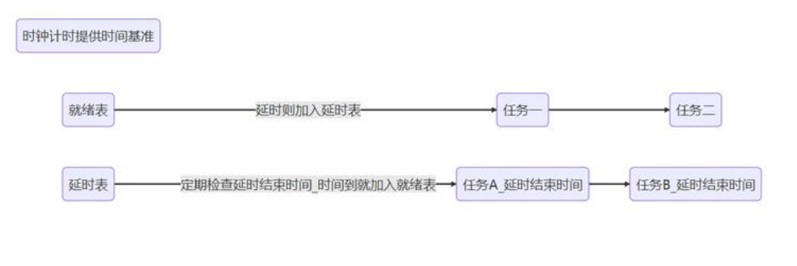

# RTOS内核学习记录（1）调度算法

## 1.算法一：遍历数组（FreeRTOS）

代码实现如下
```C
for (int prio = MAX_PRIORITY - 1; prio >= 0; prio--) {
    if (!list_empty(&ready_list[prio])) {
        next_task = list_first_entry(&ready_list[prio], TCB_t, ready_node);
        break;
    }
}
```
就是普通的遍历，先看最高优先级链表（同一优先级用一个链表）有没有任务，有的话就取出第一个任务作为下一个要运行的任务，没有就看下一个，一直找到第一个非空链表

通常优先级数字越大，优先级越小

优点：简单，容易理解
缺点：每次调度可能要扫描很多优先级
复杂度：O(优先级数量)没有任务

## 2.算法二：位图法（RT-Thread）

主要实现：
```C
int __rt_ffs(int value)
{
    if (value == 0) return 0;

    if (value & 0xff)
        return _lowest_bit_bitmap[value & 0xff] + 1;

    if (value & 0xff00)
        return _lowest_bit_bitmap[(value & 0xff00) >> 8] + 9;

    if (value & 0xff0000)
        return _lowest_bit_bitmap[(value & 0xff0000) >> 16] + 17;

    return _lowest_bit_bitmap[(value & 0xff000000) >> 24] + 25;
}

const rt_uint8_t __lowest_bit_bitmap[] =
{
    /* 00 */ 0, 0, 1, 0, 2, 0, 1, 0, 3, 0, 1, 0, 2, 0, 1, 0,
    /* 10 */ 4, 0, 1, 0, 2, 0, 1, 0, 3, 0, 1, 0, 2, 0, 1, 0,
    /* 20 */ 5, 0, 1, 0, 2, 0, 1, 0, 3, 0, 1, 0, 2, 0, 1, 0,
    /* 30 */ 4, 0, 1, 0, 2, 0, 1, 0, 3, 0, 1, 0, 2, 0, 1, 0,
    /* 40 */ 6, 0, 1, 0, 2, 0, 1, 0, 3, 0, 1, 0, 2, 0, 1, 0,
    /* 50 */ 4, 0, 1, 0, 2, 0, 1, 0, 3, 0, 1, 0, 2, 0, 1, 0,
    /* 60 */ 5, 0, 1, 0, 2, 0, 1, 0, 3, 0, 1, 0, 2, 0, 1, 0,
    /* 70 */ 4, 0, 1, 0, 2, 0, 1, 0, 3, 0, 1, 0, 2, 0, 1, 0,
    /* 80 */ 7, 0, 1, 0, 2, 0, 1, 0, 3, 0, 1, 0, 2, 0, 1, 0,
    /* 90 */ 4, 0, 1, 0, 2, 0, 1, 0, 3, 0, 1, 0, 2, 0, 1, 0,
    /* A0 */ 5, 0, 1, 0, 2, 0, 1, 0, 3, 0, 1, 0, 2, 0, 1, 0,
    /* B0 */ 4, 0, 1, 0, 2, 0, 1, 0, 3, 0, 1, 0, 2, 0, 1, 0,
    /* C0 */ 6, 0, 1, 0, 2, 0, 1, 0, 3, 0, 1, 0, 2, 0, 1, 0,
    /* D0 */ 4, 0, 1, 0, 2, 0, 1, 0, 3, 0, 1, 0, 2, 0, 1, 0,
    /* E0 */ 5, 0, 1, 0, 2, 0, 1, 0, 3, 0, 1, 0, 2, 0, 1, 0,
    /* F0 */ 4, 0, 1, 0, 2, 0, 1, 0, 3, 0, 1, 0, 2, 0, 1, 0
};
```
我认为及其巧妙的是下边这个表，配合上边的代码，假如：
value = 0x00010006, 在判断里，低位优先，会先判断0x00010006 & 0xff = 0x06,
0x06 = 0000 0110, 所以低位开始第一个1出现在第 1 位，所以优先级为 1，如果是0x07,优先级就是0
如果你有八位数，不用循环，一位一位判断，直接查表就知道最低位1在第几位，经典的基于哈希思想的空间换时间的算法，复杂度O(1)
至于为什么要加上1，是因为0表示没有任务，1表示第0位有任务，2表示第1位有任务，3表示第2位有任务，以此类推

还有因为这个表只能处理八位数据，就算这样表也很大，所以再判断32位数据的时候，从最低八位到最高八位，分四次判断，遇到有任务的八位数据，就去查表，得到最低位1的位置，然后加上偏移量（8、16、24）就可以得到最终的优先级

调用时候：
```C
highest_ready_priority = __rt_ffs(rt_thread_ready_priority_group) - 1;
ready_list = rt_thread_priority_table[highest_ready_priority];
```


# RTOS内核学习记录（2）通过时钟切换上下文

## 定时上下文切换 
    首先设置systick时钟，让他在一定时间间隔响应（我经验来看这个事件一般1ms？）然后再systick中断中触发pendsv中断，这样就可以达到定时切换上下位的目的，不用在任务中加任务切换函数
    除此之外，systick本事就是一个定时器，rtos中需要使用定时地方很多，可以高效利用他的定时功能

## 延时阻塞态

rtos中任务一般有三种状态，运行态、就绪态、阻塞态，延时就是一种阻塞态，表示他在等待某个事件发生
所以在任务处于延时的时候，可以把他移除就绪表，加入延时表，将时间给别的任务执行，等到延时时间到了，将他再加入就绪表



再延时表中，会记录他的延时到期时间，每一次systick中断，时间计数就会+1，然后比较延时表中的任务是否到时间，如果到了就从延时表中删除，加入就绪表

## 如何解决溢出？
1. 扩展计数宽度
    假如1ms计数，那么最大延时时间就是2^32 * 1ms = 4294967296ms = 49.7天，那要是用两个32位变量来计数呢，那最大时间就是 49 * 2 ^ 32天，理论上来说完全够用。但是这样处理起来不是很优雅，在设置延时时间的时候，你就不得不设置一个64位的数据，在32位系统中，64位数据的处理效率不高，会出现额外开销
2. 使用两个表进行维护
    一个表是当前表，一个表是溢出表，如果某一任务延时大于当前的溢出时间，那他就会被放在溢出表里，如果当前时间加上延时不会溢出的话，那就放在当前表里，然后再一轮溢出之后，当前表会和溢出表交换，当前表会变成溢出表，等待新一轮溢出数据的写入，然后溢出表会变成当前表，其中存着的上一轮溢出的数据，刚好在这一轮就会被执行，但是能看出来一个问题，那就是延时时间只能使tick溢出一次，在溢出大于等于两次时无法和溢出一次进行区分，但是其实溢出一次起码要有49天，这么长时间的延时大多会考虑别的计时方式